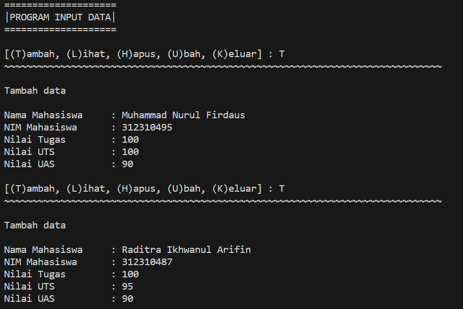

# Pertemuan ke 12
# OOP

| Variable | Isi |
| -------- | --- |
| **Nama** | Muhammad Nurul Firdaus |
| **NIM** | 312310495 |
| **Kelas** | TI.23.A.5 |
| **Mata Kuliah** | Bahasa Pemrograman |

# Tugas Praktikum

## Buat program sederhana dengan mengaplikasikan penggunaan class. Buatlah class untuk menampilkan daftar nilai mahasiswa, dengan ketentuan:
* Method tambah() untuk menambah data
* Method tampilkan() untuk menampilkan data
* Method hapus(nama) untuk menghapus data berdasarkan nama
* Method ubah(nama) untuk mengubah data berdasarkan nama

* Buat diagram class, flowchart dan penjelasan programnya pada
README.md.
* Commit dan push repository ke github.

### # Membuat ```class mahasiswa():``` dengan instance class
``````python
class mahasiswa():
    def __init__(self):
        self.nama = []
        self.nim = []
        self.tugas = []
        self.uts = []
        self.uas = []
``````

### # Menambahkan method / fungsi, pada data inputan `Nama`, `NIM`, `UTS`, `UAS`, `Tugas`.
``````python
# Menambahkan data inputan 
    def tambah(self):
        print("Tambah data\n")
        nama    = input("Nama Mahasiswa     : ")
        self.nama.append(nama)
        nim     = int(input("NIM Mahasiswa      : "))
        self.nim.append(nim)
        tugas   = int(input("Nilai Tugas        : "))
        self.tugas.append(tugas)
        uts     = int(input("Nilai UTS          : "))
        self.uts.append(uts)
        uas     = int(input("Nilai UAS          : "))
        self.uas.append(uas)
``````

### # Menampilkan method / fungsi. `f` = Format
``````python
# Menampilkan seluruh data 
    def lihat(self):
        for i in range(len(self.nama)):
            print(f"\nData ke -{i+1}")
            print(f"Nama Mahasiswa: {self.nama[i]}")
            print(f"NIM Mahasiswa : {self.nim[i]}")
            print(f"Nilai UTS     : {self.uts[i]}")
            print(f"Nilai UAS     : {self.uas[i]}")
            print(f"Nilai TUGAS   : {self.tugas[i]}")
``````

### # Menghapus data yg sudah di input. ```del self.nama[index]``` = menghapus nama
### # ```[index]``` Berfungsi agar inputan menjadi object
``````python
# Menghapus inputan nama
    def hapus(self, nama):
        print("Hapus data inputan")
        nama = (input("\nMasukan Nama Mahasiswa : "))
        if nama in self.nama:
            print("Data {0} berhasil di hapus".format(nama))
            index = self.nama.index(nama)
            del self.nama[index]
            del self.nim[index]
            del self.tugas[index]
            del self.uts[index]
            del self.uas[index]
        else:
            print("NAMA {0} TIDAK ADA!".format(nama))
``````

### # Mengubah data yg sudah di input
### # ```index = self.nama.index(nama)``` Membuat variable index dengan ```self.nama``` di dalam nya
``````python
# Mengubah data nama inputan
    def ubah(self, nama):
        nama = input("Nama yang ingin di ubah : ")
        if nama in self.nama:
            index = self.nama.index(nama)
            self.nim[index]     = int(input("NIM            : "))
            self.tugas[index]   = int(input("Nilai Tugas    : "))
            self.uts[index]     = int(input("Nilai UTS      : "))
            self.uas[index]     = int(input("Nilai UAS      : "))

            print("\nData {0} berhasil di ubah".format(nama))
        else:
            print("NAMA {0} TIDAK ADA!".format(nama))
``````

### # Perulangan dengan memilih [T/L/H/U/K] untuk menjalankan program apa yg ingin di gunakan.

## Hasil Program
### Menambahkan data :


### Melihat data :


### Mengubah data :


### Menghapus data :


## Flowchartnya :
